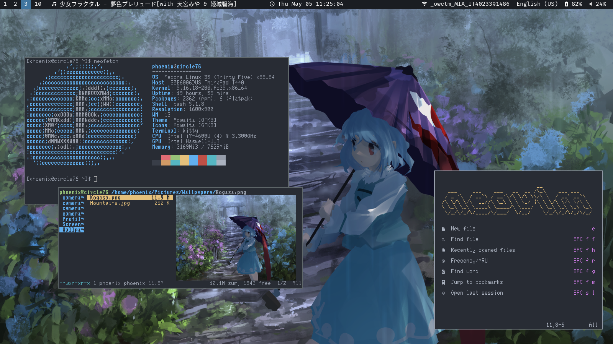

<h2></h2> 

    <b>fuenix86's Linux configuration files</b>

<h2></h2> 

    

### Features
| Programs   | Using             |
| ---------- | ----------------- |
| WM         | i3                |
| OS         | fedora            |
| Terminal   | kitty             |
| Shell      | bash              |
| Editor     | neovim            |
| Compositor | none!             |

I like having a long long battery life :)

### Install the fonts
+ **FiraCode Nerd Font** - [here](https://github.com/ryanoasis/nerd-fonts/blob/master/patched-fonts/FiraCode/Regular/complete/Fira%20Code%20Regular%20Nerd%20Font%20Complete%20Mono.ttf)
+ **Ac437 NEC Multispeed** - [here](https://int10h.org/oldschool-pc-fonts/fontlist/font?nec_multispeed)
+ **Operator Mono Book Italic** - [here](https://fontsfree.net/operator-mono-book-italic-2-font-download.html)
+ **Source Han Sans JP** - [here](https://pkgs.org/search/?q=sourcehans)
